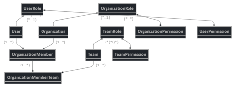
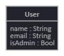
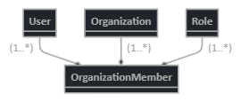

# Software Design

Software design, or architecture, is a difficult problem to handle because, in the majority of cases, there is no one correct answer. If you've worked on a software project in the past, it's likely (like Goldilocks) that you've run across a scenario where the design was either too complex (too hot, too hard) or too simple (too cold, too soft) to adequately handle the problem at hand. Let's take a look at some concrete examples in the form of a user system for an application and investigate some of the issues we can run across when starting out at either extreme.

## Too complex

Above is an example of a user model that I would consider to be too complex for the beginning of a project. While you may eventually end up with something looking similar to that, here are a few reasons that you wouldn't want to start with that:

### Speed of iteration

If your organization is using an agile approach to software development, the goal isn't to create the final version of your software on the first iteration. It's to demonstrate a version of the software with features that are necessary to accomplish the standard workflow of the application (whatever that might be). This is often referred to as the minimum viable product (MVP). While you may eventually need to set specific permissions for a role, is it necessary to show a functional product? Unlikely.

### Crystal ball

If you were to know exactly what your product would eventually need to support before you started development, you could guarantee that none of the stakeholders in the project would change their minds after seeing the software in use, and that the business case for the product in question would remain the same when development was finished, then designing the complex version from the beginning makes sense. If you've ever been in that scenario, I'd like to chat with you because you are a unicorn.

### Priorities

This piggybacks off of some of the points made previously, but any time you spend developing and testing the scenarios for the complex model is time that you can't spend developing other parts of the application. The longer it takes you to develop an application that you can demonstrate to the stakeholders, the more likely it is that your project gets cancelled or that the expectations you need to meet drastically change.

## Too simple

At the other extreme, we've got a model that's "too simple". While this one may serve your needs for a brief moment, it's probably better to expand upon this one before you get going.

### Distraction

A problem you can have with too simple a data model is that it leaves enough out that the stakeholders can't focus on anything other than what's missing. If you're showing off your MVP and the majority of the questions you get are of the "Well what about ...?" persuasion, it likely means that you left so much out that the end goal isn't clear. 

### Rework

A simple model can work if you leave yourself logic places to extend the model for future plans. However, placing all the data into a single table or placing items that should be relationships into either-or types of fields will artificially limit what you can do without lots of rework. In the example above, storing `name` as a single field instead of breaking it into a `first_name` (or `given_name` for a less Eurocentric form) and `last_name` (`family_name`) makes any sorting or filtering that you'd want to do in the future more difficult. In the same vein, `isAdmin` only allows you to have two types of users, while adding a `Role` model with a relationship to a `User` model allows you to expand that as needed in the future.

## Just right

While this is labeled the "just right" model to fit in with our Goldilocks analogy, what is right for your specific scenario will differ based on your product, your stakeholders, your timeline, and other factors that are specific to your case. However, there are a few things we can note here.

### Simple but expandable

In the example above, we can have users that belong to a group (called `Organization` in this example, but could be different based on your use case) and that relationship is flexible enough that we can expand the definition of what an organization is without redefining the relationship between a user and an organization. Likewise, we can give that relationship a role. In the beginning, those roles may just be `Admin` and `Non-Admin` but the model gives us the flexibility to define additional roles in the future without needing to redefine relationships between models.

### Excludes items beyond the horizon

In our "too complex" example, we included various permission models for each of the different relationships. However, at the beginning of a project, it's unlikely that you'll need to get that granular. Do we know that you'll need to have adjustable permissions for different roles or can the roles themselves be enough for our application to know what a user should and should not be able to do? Do you need that level of detail to present an MVP to your stakeholders?

# Summary

Just as Goldilocks was looking for the bowl of porridge, the chair, and the bed that were "just right", you should also strive when designing an application to hit that middle spot between extremes, with enough fleshed out to convey the ending vision of your application and enough flexibility to expand on that initial model without major difficulties while avoiding details that are likely to change or not be needed in the future. I'm sure you can thinking of many situations in the past were projects you've been a part of have been off the mark of "just right" and I'd love to here about them in the comments.
